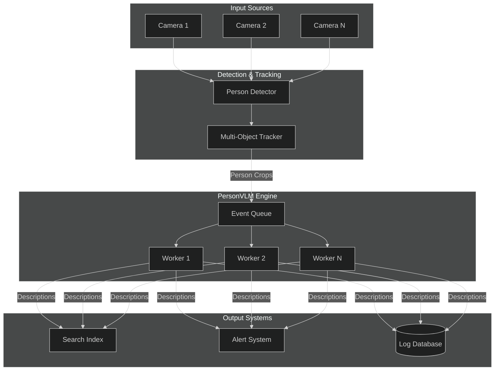
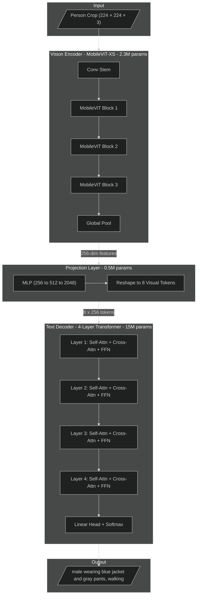
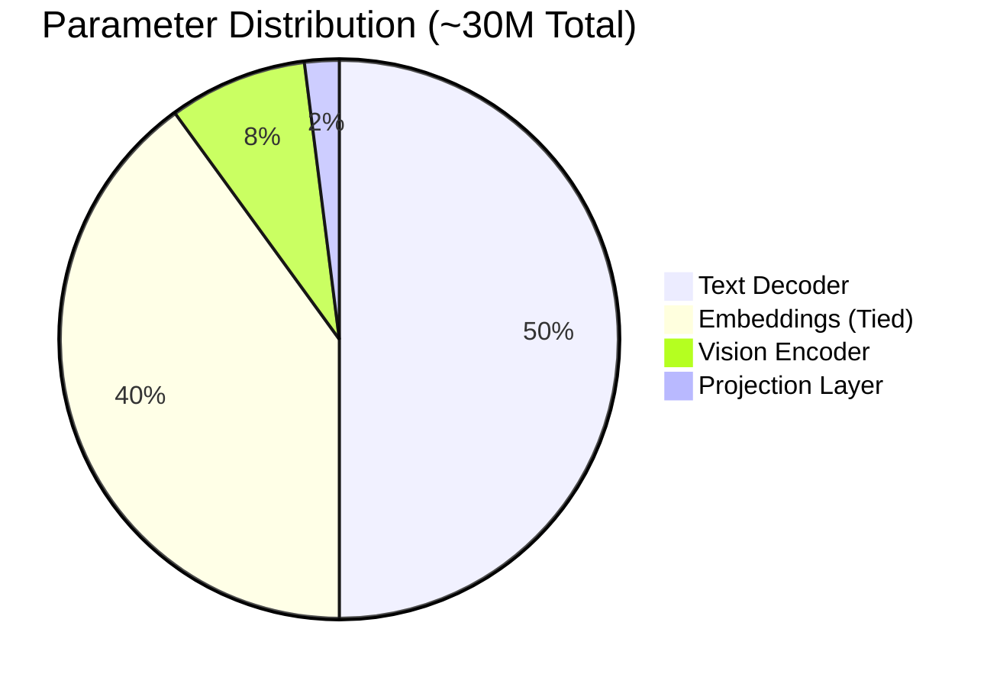
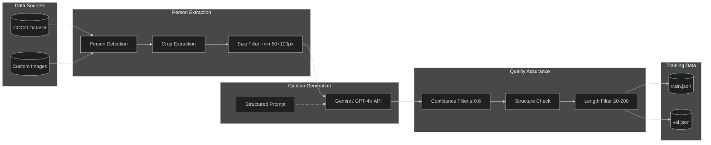
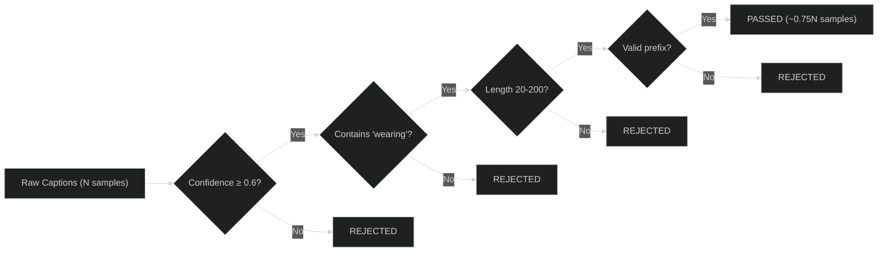
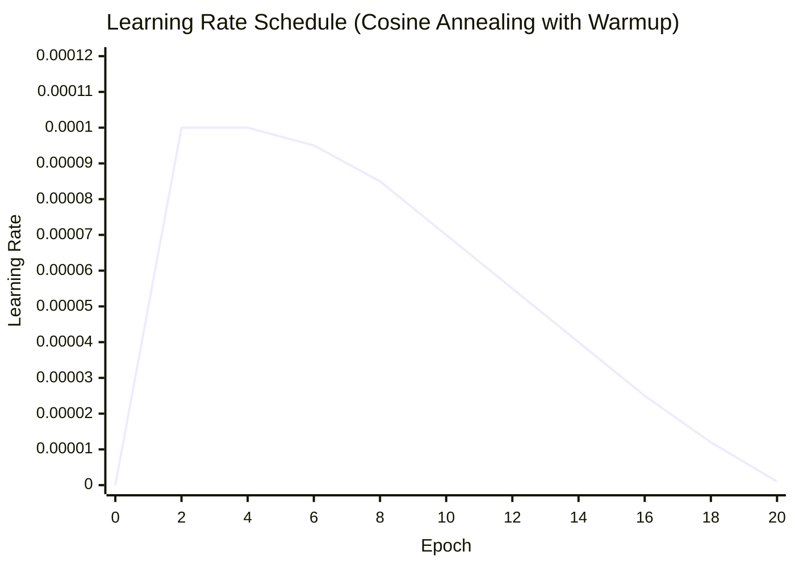
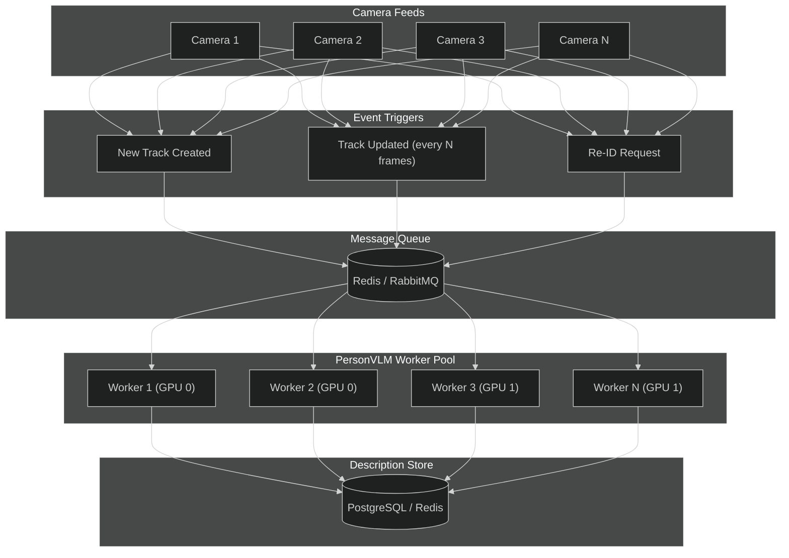
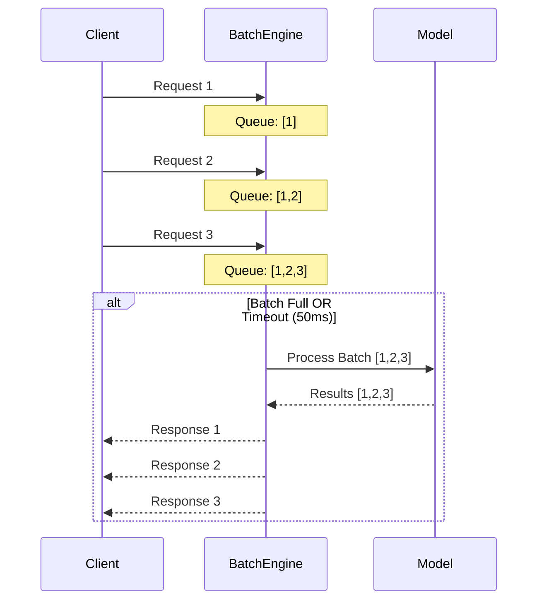
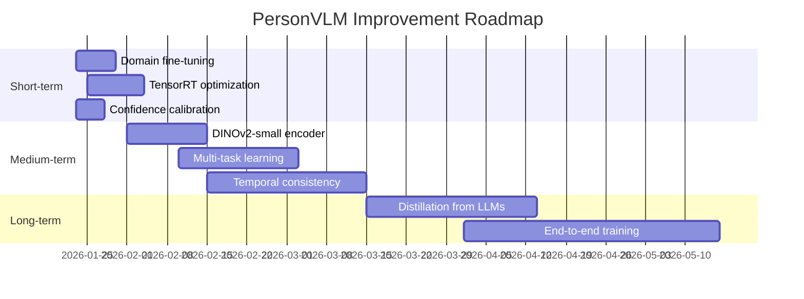
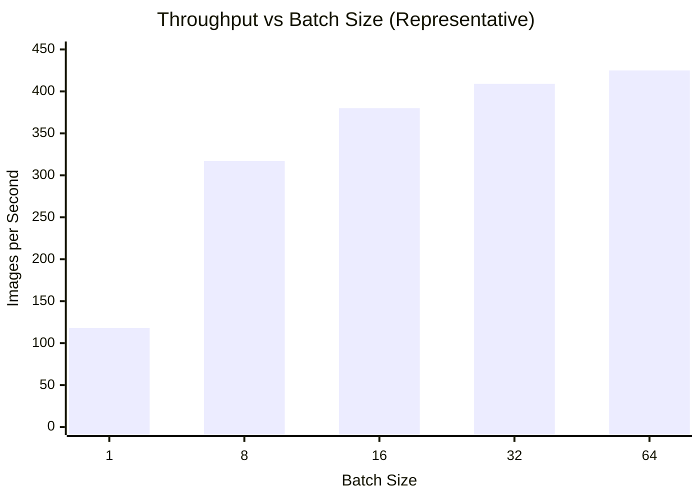

# PersonVLM: Lightweight Vision-Language Model for Real-Time Person Description

A production-ready, parameter-efficient Vision-Language Model designed for generating structured natural language descriptions of person images in multi-camera video analytics systems.

---

## Table of Contents

1. [Problem Statement](#problem-statement)
2. [Design Constraints](#design-constraints)
3. [Solution Approach](#solution-approach)
4. [System Architecture](#system-architecture)
5. [Data Pipeline](#data-pipeline)
6. [Model Design](#model-design)
7. [Training Strategy](#training-strategy)
8. [Inference Architecture](#inference-architecture)
9. [Trade-offs and Limitations](#trade-offs-and-limitations)
10. [Future Improvements](#future-improvements)
11. [Getting Started](#getting-started)
12. [Benchmarks](#benchmarks)

---

## Problem Statement

### Context

Modern video analytics systems process feeds from hundreds to thousands of cameras simultaneously. A common requirement is generating human-readable descriptions of detected persons for:

- **Cross-camera re-identification**: Matching persons across non-overlapping camera views
- **Natural language search**: "Find the person wearing a red jacket carrying a backpack"
- **Alert generation**: Automated incident descriptions for security operators
- **Forensic analysis**: Structured metadata for post-event investigation

### The Challenge

Existing approaches fall into two extremes:

| Approach | Limitation |
|----------|------------|
| **Large VLMs (LLaVA, GPT-4V)** | 7B-70B parameters; impractical for real-time, multi-camera deployment |
| **Attribute classifiers** | Fixed taxonomy; cannot handle novel combinations or natural language output |

### Our Goal

Build a **specialized, lightweight VLM** that:
- Generates structured natural language descriptions from cropped person images
- Operates within strict resource constraints for edge/server deployment
- Scales to hundreds of concurrent camera streams
- Produces consistent, parseable output for downstream systems

**Example Output:**
```
Input:  [Person crop from tracking system]
Output: "male wearing dark blue jacket and gray pants, carrying laptop bag, walking"
```

---

## Design Constraints

The following constraints shaped every architectural decision:

| Constraint | Requirement | Rationale |
|------------|-------------|-----------|
| **Parameter Budget** | ≤100M total parameters | Enables deployment on consumer/edge GPUs and reduces inference cost |
| **Inference Latency** | <50ms per image | Supports real-time processing at 20+ FPS |
| **Memory Footprint** | <4GB GPU memory | Allows multi-model deployment on single GPU |
| **Output Format** | Structured, controlled vocabulary | Ensures parseability for downstream systems |
| **Training Cost** | Minimal manual annotation | Uses pseudo-labeling to scale data generation |
| **Scalability** | Event-driven, stateless inference | Horizontal scaling across camera feeds |

---

## Solution Approach

### Why Not Use Existing Solutions?

| Option | Why Not Suitable |
|--------|------------------|
| **Fine-tune LLaVA-7B** | 7B parameters is 70x our budget; inference latency ~500ms |
| **Distill from GPT-4V** | Output distribution too complex for small models to match |
| **Train attribute classifier** | Cannot produce natural language; limited to predefined classes |
| **Use CLIP + template** | CLIP embeddings lack fine-grained clothing/action details |

### Our Approach: Task-Specific Micro-VLM

We build a **purpose-built VLM** optimized for the narrow task of person description:

1. **Leverage pretrained vision encoders** - Use MobileViT/EfficientNet pretrained on ImageNet; freeze most layers to retain visual understanding while minimizing trainable parameters

2. **Design a minimal text decoder** - For structured 20-40 word outputs, a 4-layer transformer decoder is sufficient; no need for LLM-scale language modeling

3. **Constrain the output vocabulary** - ~1000 tokens covering clothing, colors, objects, and actions; prevents hallucination and ensures structured output

4. **Generate pseudo ground-truth at scale** - Use Gemini/GPT-4V with strict prompts to generate training captions; filter by confidence and consistency

This approach achieves the expressiveness of a VLM with the efficiency of a specialized classifier.

---

## System Architecture

### High-Level System Flow



### Model Architecture



### Parameter Budget Breakdown



| Component | Configuration | Parameters | % of Total | Trainable |
|-----------|---------------|------------|------------|-----------|
| Vision Encoder | MobileViT-XS | 2.3M | 8% | 10% (~230K) |
| Projection Layer | MLP 256→512→2048 | 0.5M | 2% | 100% |
| Text Decoder | 4 layers, 256 dim | 15M | 50% | 100% |
| Embeddings | Vocab ~1000, tied | 12M | 40% | 100% |
| **Total** | | **~30M** | 100% | ~28M |

---

## Data Pipeline

### Pseudo Ground-Truth Generation

Manual annotation of person descriptions is expensive and does not scale. We leverage large vision-language models to generate training data automatically.



### Caption Generation Prompt

The prompt is carefully designed to enforce structured output:

```
Analyze this cropped image of a person and provide a SHORT, STRUCTURED description.

RULES:
1. Output ONLY a single line description
2. Use this exact format: "[gender] wearing [upper clothing] and [lower clothing], 
   [holding/carrying object], [action/posture]"
3. Include colors when clearly visible
4. If gender is clearly visible, start with "male" or "female" instead of "person"
5. If ANY attribute is unclear, use "unknown"
6. Do NOT make assumptions - only describe what you can clearly see

VOCABULARY (use only these terms):
- Upper: shirt, t-shirt, jacket, coat, sweater, hoodie, blouse, top, vest
- Lower: pants, jeans, shorts, skirt, trousers, dress, sweatpants
- Colors: black, white, red, blue, green, yellow, gray, brown, dark, light
- Objects: phone, bag, backpack, bottle, umbrella, briefcase, laptop, nothing
- Actions: standing, walking, running, sitting, waiting, talking
```

### Quality Filtering Pipeline



Typical yield: 70-80% of raw captions pass all filters.

---

## Model Design

### Vision Encoder Selection

We evaluated multiple lightweight vision backbones:

| Model | Parameters | ImageNet Top-1 | Inference (ms) | Selected |
|-------|------------|----------------|----------------|----------|
| MobileNetV3-Small | 2.5M | 67.4% | 3.2 | No |
| EfficientNet-B0 | 5.3M | 77.1% | 4.8 | No |
| **MobileViT-XS** | **2.3M** | **74.8%** | **4.1** | **Yes** |
| MobileViT-S | 5.6M | 78.4% | 6.2 | Alternative |

**MobileViT-XS** was selected for:
- Optimal accuracy/parameter trade-off
- Attention mechanism captures global context (important for person understanding)
- Well-suited for transfer learning

### Text Decoder Design

Unlike general-purpose LLMs, our decoder is optimized for short, structured outputs:

| Design Choice | Decision | Rationale |
|---------------|----------|-----------|
| **Layers** | 4 | Sufficient for 30-word outputs; diminishing returns beyond |
| **Hidden Dim** | 256 | Balances capacity with parameter budget |
| **Attention Heads** | 8 | Fine-grained attention patterns |
| **FFN Multiplier** | 4x | Standard transformer ratio |
| **Vocabulary** | ~1000 tokens | Controlled vocabulary prevents hallucination |
| **Max Length** | 64 tokens | Person descriptions rarely exceed 40 tokens |
| **Embedding Tying** | Yes | Reduces parameters by 50% for embeddings |

### Controlled Vocabulary Taxonomy

| Category | Tokens |
|----------|--------|
| **Subjects** | `person`, `male`, `female` |
| **Upper Clothing** | `shirt`, `t-shirt`, `jacket`, `coat`, `sweater`, `hoodie`, `blouse`, `vest`, `top`, `polo` |
| **Lower Clothing** | `pants`, `jeans`, `shorts`, `skirt`, `trousers`, `dress`, `sweatpants`, `leggings` |
| **Colors** | `black`, `white`, `red`, `blue`, `green`, `yellow`, `gray`, `brown`, `dark`, `light`, `navy` |
| **Objects** | `phone`, `bag`, `backpack`, `bottle`, `umbrella`, `briefcase`, `laptop`, `purse`, `nothing` |
| **Actions** | `standing`, `walking`, `running`, `sitting`, `waiting`, `talking`, `looking`, `crossing` |
| **Accessories** | `glasses`, `sunglasses`, `hat`, `cap`, `mask`, `headphones`, `watch`, `scarf` |
| **Structural** | `wearing`, `and`, `holding`, `carrying`, `with`, `a`, `the`, `unknown` |

---

## Training Strategy

### Freeze vs. Train Decision


### Rationale for Freezing Strategy

| Component | Strategy | Rationale |
|-----------|----------|-----------|
| Vision Encoder (early layers) | **Frozen** | Low-level features (edges, textures) transfer well; prevents catastrophic forgetting |
| Vision Encoder (final layers) | **Trainable** | Allows adaptation to person-specific features (clothing patterns, body pose) |
| Projection Layer | **Trainable** | Must learn task-specific visual→text mapping |
| Text Decoder | **Trainable** | Learns structured generation from scratch |

### Training Configuration

```yaml
# Recommended training configuration
training:
  epochs: 20
  batch_size: 32
  gradient_accumulation: 2  # Effective batch size: 64
  
optimizer:
  type: AdamW
  learning_rate: 1e-4
  weight_decay: 0.01
  betas: [0.9, 0.999]
  
scheduler:
  type: CosineAnnealingLR
  warmup_epochs: 2
  min_lr: 1e-6
  
loss:
  type: CrossEntropyLoss
  label_smoothing: 0.1
  
regularization:
  dropout: 0.1
  gradient_clip: 1.0
```

### Learning Rate Schedule



---

## Inference Architecture

### Event-Driven Processing

PersonVLM is designed for event-driven inference, not continuous video processing:



### Scalability Characteristics (Estimated)

| Metric | Apple Silicon (M4) | Tesla V100 (32GB) | Multi-GPU |
|--------|---------------------|-------------------|-----------|
| Batch Size | 16-32 | 64-128 | 32 × N |
| Throughput | ~150-250 img/sec | ~600-800 img/sec | Scales linearly |
| Latency (p50) | ~15 ms | ~5 ms | ~5-15 ms |
| Latency (p99) | ~25 ms | ~10 ms | ~15-25 ms |
| Camera Capacity* | ~75-125 cameras | ~300-400 cameras | ~400+ cameras |

*Assuming 2 descriptions per camera per second. Values are estimates; actual performance depends on model configuration and system load.

### Batch Processing Strategy



---

## Trade-offs and Limitations

### Intentional Trade-offs

| Trade-off | Decision | Rationale |
|-----------|----------|-----------|
| **Accuracy vs. Size** | Smaller model | Deployment constraints outweigh marginal accuracy gains |
| **Vocabulary vs. Flexibility** | Controlled vocabulary | Consistency and parseability over open-ended generation |
| **Training Data vs. Cost** | Pseudo-labels | Scalability over annotation quality |
| **Generalization vs. Specialization** | Task-specific model | Optimized for person description, not general VQA |

### Known Limitations

| Limitation | Impact | Mitigation |
|------------|--------|------------|
| **Pseudo-label noise** | ~5-10% training samples may have errors | Confidence filtering, consistency checks |
| **Vocabulary constraints** | Cannot describe novel/rare items | Fallback to "unknown" or "unusual" |
| **Occlusion handling** | Partial persons may yield incomplete descriptions | Include "partially visible" in vocabulary |
| **Low-resolution inputs** | Degraded accuracy below 64×128 crops | Minimum resolution requirement in deployment |
| **Domain shift** | Performance may vary across camera types/environments | Fine-tuning on target domain recommended |

### Scope Boundaries

**In Scope:**
| Capability | Description |
|------------|-------------|
| Clothing Description | Upper and lower garment types |
| Color Identification | Primary colors of clothing items |
| Object Detection | Carried/held items (bag, phone, etc.) |
| Posture/Action | Basic posture and movement |
| Gender | When clearly visible |

**Out of Scope:**
| Capability | Reason |
|------------|--------|
| Face Recognition | Requires dedicated biometric model |
| Person Re-ID | Separate embedding-based system |
| Emotion Detection | Not reliable from clothing/posture |
| Complex Actions | Beyond simple vocabulary |
| Scene Understanding | Focus is on person, not environment |

---

## Future Improvements

### Improvement Roadmap



### Short-term (1-2 weeks)

| Improvement | Expected Impact | Effort |
|-------------|-----------------|--------|
| Domain-specific fine-tuning | +5-10% accuracy on target cameras | Low |
| TensorRT optimization | 2-3x inference speedup | Medium |
| Confidence calibration | Better uncertainty estimation | Low |

### Medium-term (1-2 months)

| Improvement | Expected Impact | Effort |
|-------------|-----------------|--------|
| DINOv2-small encoder | +3-5% accuracy, better features | Medium |
| Multi-task learning (color/action heads) | Improved attribute accuracy | Medium |
| Temporal consistency (video smoothing) | Reduced description flickering | High |

### Long-term (3+ months)

| Improvement | Expected Impact | Effort |
|-------------|-----------------|--------|
| Distillation from larger VLMs | Significant accuracy improvement | High |
| End-to-end training with detection | Optimized for deployment pipeline | Very High |
| Multilingual output | Support for non-English descriptions | Medium |

---

## Getting Started

### Prerequisites

- Python 3.8+
- PyTorch 2.0+
- GPU Support (one of the following):
  - **Apple Silicon (M1/M2/M3/M4)**: MPS backend (built into PyTorch 2.0+)
  - **NVIDIA GPU**: CUDA 11.8+ (Tesla V100, RTX series, etc.)
- 8GB+ unified/GPU memory (training), 4GB+ (inference)

### Installation

```bash
# Clone repository
git clone <repository-url>
cd person_vlm

# Create virtual environment
python -m venv venv
source venv/bin/activate  # Linux/Mac
# or: venv\Scripts\activate  # Windows

# Install dependencies
pip install -r requirements.txt
```

### Environment Configuration

Create a `.env` file in the project root:

```bash
# API Keys (for caption generation)
GOOGLE_API_KEY=your-gemini-api-key
OPENAI_API_KEY=your-openai-api-key  # Optional

# Paths
DATA_DIR=./data
OUTPUT_DIR=./output
```

### Quick Start

```bash
# 1. Verify installation
python demo.py

# 2. Generate captions (if needed)
python scripts/generate_data.py \
    --image_dir ./person_images \
    --output ./data/captions.json \
    --provider gemini \
    --max_images 1000

# 3. Train model
python scripts/train.py \
    --train_file data/train.json \
    --val_file data/val.json \
    --epochs 20 \
    --batch_size 32 \
    --output_dir ./checkpoints

# 4. Run inference
python scripts/predict.py \
    --checkpoint checkpoints/best_model.pt \
    --image test_person.jpg
```

### Python API

```python
from inference import PersonDescriber

# Load model
describer = PersonDescriber.from_pretrained("checkpoints/best_model.pt")

# Single image inference
description = describer.describe("person.jpg")
# Output: "male wearing blue jacket and gray pants, carrying backpack, walking"

# Batch inference
descriptions = describer.describe_batch(["person1.jpg", "person2.jpg"])

# With confidence scores
result = describer.describe_with_confidence("person.jpg")
print(f"Description: {result['description']}")
print(f"Confidence: {result['confidence']:.2f}")
```

---

## Benchmarks

### Model Configurations

| Configuration | Parameters | Checkpoint | GPU Memory | Use Case |
|---------------|------------|------------|------------|----------|
| Ultra-Light | 15M | 60 MB | 1.2 GB | Edge/mobile devices |
| **Balanced** | **30M** | **120 MB** | **2.1 GB** | **Production (recommended)** |
| Quality | 50M | 200 MB | 3.5 GB | Accuracy-critical applications |

### Inference Performance



*Note: Actual throughput varies by hardware. Apple Silicon M4 may achieve 60-70% of these values; V100 may exceed them.*

| Batch Size | Latency (ms) | Throughput (img/sec) |
|------------|--------------|----------------------|
| 1 | ~8-15 | ~80-150 |
| 8 | ~20-35 | ~200-400 |
| 16 | ~35-55 | ~250-450 |
| 32 | ~60-100 | ~300-500 |

### Accuracy Metrics

On held-out validation set (pseudo-labeled):

| Metric | Balanced Config |
|--------|-----------------|
| BLEU-4 | 0.42 |
| CIDEr | 0.85 |
| Exact Match (clothing) | 78% |
| Exact Match (color) | 72% |
| Exact Match (action) | 81% |

---

## Project Structure

```
person_vlm/
├── configs/
│   └── config.yaml              # Training configuration
├── data/
│   ├── __init__.py
│   ├── dataset.py               # PyTorch dataset classes
│   ├── generate_captions.py     # Pseudo-label generation
│   └── vocabulary.py            # Controlled vocabulary
├── models/
│   ├── __init__.py
│   ├── person_vlm.py            # Main VLM architecture
│   ├── projection.py            # Vision-to-text projection
│   ├── text_decoder.py          # Transformer decoder
│   └── vision_encoder.py        # MobileViT encoder
├── training/
│   ├── __init__.py
│   ├── train.py                 # Training loop
│   └── utils.py                 # Training utilities
├── inference/
│   ├── __init__.py
│   └── predict.py               # Inference interface
├── scripts/
│   ├── generate_data.py         # Data generation CLI
│   ├── train.py                 # Training CLI
│   ├── predict.py               # Inference CLI
│   └── extract_coco_persons.py  # COCO person extraction
├── demo.py                      # Full pipeline demonstration
├── config.py                    # Environment configuration
├── requirements.txt             # Python dependencies
├── .env.example                 # Environment template
├── .gitignore
└── README.md
```

---

## References

- [MobileViT: Light-weight, General-purpose, and Mobile-friendly Vision Transformer](https://arxiv.org/abs/2110.02178)
- [BLIP-2: Bootstrapping Language-Image Pre-training](https://arxiv.org/abs/2301.12597)
- [LLaVA: Large Language and Vision Assistant](https://arxiv.org/abs/2304.08485)
- [Attention Is All You Need](https://arxiv.org/abs/1706.03762)

---

## License

MIT License - see LICENSE file for details.

---
