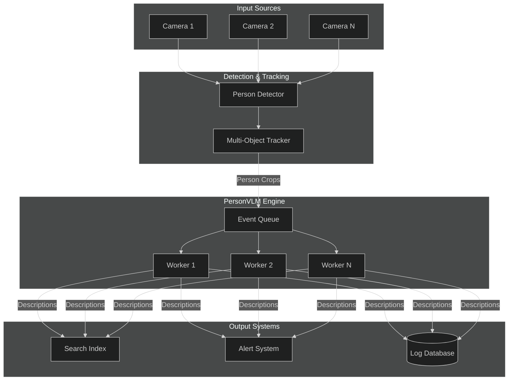
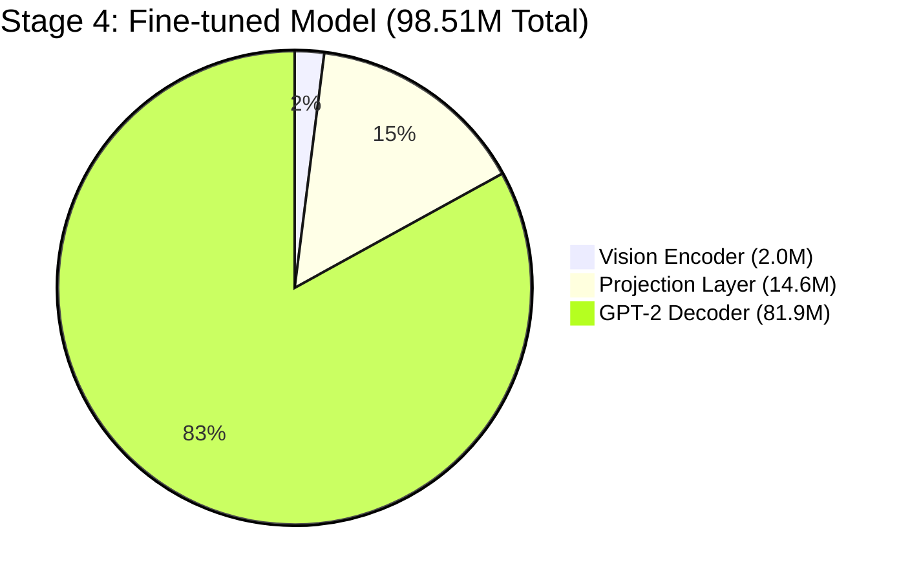
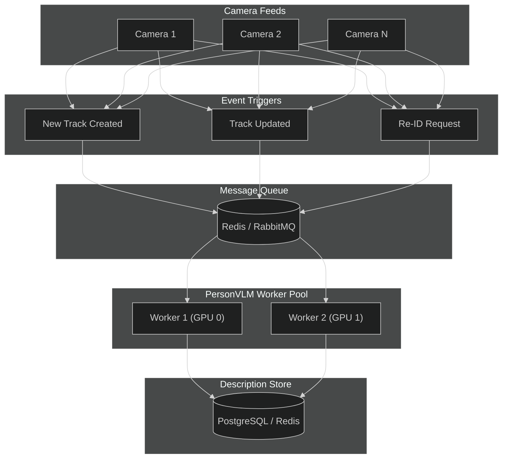

# PersonVLM: Lightweight Vision-Language Model for Real-Time Person Description

## Executive Summary

**PersonVLM** is a lightweight vision-language model designed to generate structured natural language descriptions of people from cropped images in real-time video analytics systems.

### Complete Model Progression

We developed PersonVLM through a systematic 4-stage progression, demonstrating the impact of scaling, pretrained backbones, and fine-tuning:

| Metric | Stage 1: Baseline | Stage 2: Scaled | Stage 3: Pretrained | Stage 4: Fine-tuned |
|--------|-------------------|-----------------|---------------------|---------------------|
| **Parameters** | 7.26M | 33.84M | 93.78M | 98.51M |
| **Budget Used** | 7.3% | 33.8% | 93.8% | 98.5% |
| **Validation Loss** | 2.80 | 2.63 | 2.40 | **2.26** |
| **BLEU-4** | 24.19% | 23.16% | 24.36% | **24.86%** |
| **CIDEr** | 0.75 | 0.73 | 0.79 | **0.83** |
| **ROUGE-L** | 42.98% | 41.34% | 41.68% | **42.22%** |
| **Decoder Type** | Custom (4-layer) | Custom (6-layer) | DistilGPT-2 (frozen) | DistilGPT-2 (unfrozen) |
| **Training Time** | ~2.8 hours (M4) | ~11 min (V100) | ~9 min (V100) | ~40 min (V100) |

**Key Findings:**
- **Stage 1→2**: Simply scaling parameters provides minimal improvement
- **Stage 2→3**: Leveraging pretrained language models significantly reduces loss
- **Stage 3→4**: Full fine-tuning achieves the best results across all metrics

**Recommended Model: Stage 4 (Fine-tuned, 98.51M)** — Best performance while staying within 100M budget.

The system is optimized for **scalability** across hundreds of camera streams, **low inference latency** (<50ms per image), and **cost-efficient deployment** on consumer-grade GPUs.

### Screenshots

#### Demo Website - Hero Section


#### Inference Results Comparison


#### Training Metrics Dashboard


---

## Table of Contents

1. [Problem Statement](#problem-statement)
2. [Design Constraints](#design-constraints)
3. [Solution Approach](#solution-approach)
4. [System Architecture](#system-architecture)
5. [Data Pipeline](#data-pipeline)
6. [Model Design](#model-design)
7. [Experimental Progression](#experimental-progression)
   - [Stage 1: Baseline Model](#stage-1-baseline-model-726m-parameters)
   - [Stage 2: Scaled Model](#stage-2-scaled-model-3384m-parameters)
   - [Stage 3: Pretrained Decoder](#stage-3-pretrained-decoder-9378m-parameters)
   - [Stage 4: Fine-tuned Model](#stage-4-fine-tuned-model-9851m-parameters)
8. [Results Analysis](#results-analysis)
9. [Inference Architecture](#inference-architecture)
10. [Trade-offs and Limitations](#trade-offs-and-limitations)
11. [Getting Started](#getting-started)
12. [Benchmarks](#benchmarks)

---

## Problem Statement

### Context

Modern video analytics systems process feeds from hundreds to thousands of cameras simultaneously. A common requirement is generating human-readable descriptions of detected persons for:

- **Cross-camera re-identification**: Matching persons across non-overlapping camera views
- **Natural language search**: "Find the person wearing a red jacket carrying a backpack"
- **Alert generation**: Automated incident descriptions for security operators
- **Forensic analysis**: Structured metadata for post-event investigation

### The Challenge

Existing approaches fall into two extremes:

| Approach | Limitation |
|----------|------------|
| **Large VLMs (e.g., LLaVA, Gemini, GPT-4V)** | 7B-70B parameters; impractical for real-time, multi-camera deployment |
| **Attribute classifiers** | Fixed taxonomy; cannot handle novel combinations or natural language output |

### Our Goal

Build a **specialized, lightweight VLM** that:
- Generates structured natural language descriptions from cropped person images
- Operates within strict resource constraints (≤100M parameters)
- Scales to hundreds of concurrent camera streams
- Produces consistent, parseable output for downstream systems

---

## Design Constraints

| Constraint | Requirement | Rationale |
|------------|-------------|-----------|
| **Parameter Budget** | ≤100M total parameters | Enables deployment on consumer/edge GPUs |
| **Inference Latency** | <50ms per image | Supports real-time processing at 20+ FPS |
| **Memory Footprint** | <4GB GPU memory | Allows multi-model deployment |
| **Output Format** | Structured vocabulary | Ensures parseability for downstream systems |

---

## Solution Approach

### Our Approach: Task-Specific Micro-VLM with Pretrained Backbone

We build a **purpose-built VLM** optimized for person description through progressive refinement:

1. **Leverage pretrained vision encoders** - MobileViT-XS pretrained on ImageNet
2. **Leverage pretrained language models** - DistilGPT-2 as decoder (key innovation)
3. **Fine-tune end-to-end** - Unfreeze decoder for task-specific adaptation
4. **Use prefix-based visual conditioning** - Project visual features to LM embedding space

This approach achieves the expressiveness of a VLM with the efficiency of a specialized model.

---

## System Architecture

### High-Level System Flow



### Model Architecture Evolution

#### Baseline Architecture (Stages 1-2)
```
┌─────────────────┐     ┌──────────────┐     ┌─────────────────────┐
│  Vision Encoder │     │  Projection  │     │  Custom Decoder     │
│  MobileViT-XS   │ --> │  MLP Layer   │ --> │  4-6 Layer Xformer  │
│  2.0M params    │     │  1-5M params │     │  4-27M params       │
└─────────────────┘     └──────────────┘     └─────────────────────┘
```

#### Pretrained Architecture (Stages 3-4)
```
┌─────────────────┐     ┌──────────────┐     ┌─────────────────────┐
│  Vision Encoder │     │  Projection  │     │  Pretrained Decoder │
│  MobileViT-XS   │ --> │  MLP → 12    │ --> │  DistilGPT-2        │
│  2.0M params    │     │  Visual Tkns │     │  82M params         │
│  (30% trainable)│     │  14.6M params│     │  (50-100% trainable)│
└─────────────────┘     └──────────────┘     └─────────────────────┘
```

### Parameter Budget Comparison



---

## Data Pipeline

### Dataset: MSP60k

We use the **MSP60k dataset**, a pre-captioned collection of cropped person images with structured natural language descriptions.

| Metric | Value |
|--------|-------|
| **Training samples** | 27,000 |
| **Validation samples** | 3,000 |
| **Total images** | 30,000 |
| **Avg caption length** | ~30-50 tokens |

### Data Format

```json
{
  "image": "path/to/person_crop.jpg",
  "answer": "The image shows a male adult with black hair wearing a red jacket..."
}
```

---

## Model Design

### Vision Encoder: MobileViT-XS

| Property | Value |
|----------|-------|
| Parameters | 2.0M |
| ImageNet Top-1 | 74.8% |
| Output Dimension | 256 |
| Freeze Ratio | 70-80% |

**Why MobileViT-XS:**
- Optimal accuracy/parameter trade-off
- Attention mechanism captures global context
- Well-suited for transfer learning

### Text Decoder Comparison

| Property | Custom Decoder (Stages 1-2) | DistilGPT-2 (Stages 3-4) |
|----------|----------------------------|--------------------------|
| Parameters | 4-27M | 82M |
| Layers | 4-6 | 6 |
| Hidden Dim | 256-512 | 768 |
| Vocabulary | 3,179 (custom) | 50,257 (GPT-2) |
| Pretrained | No | Yes (web text) |
| Language Quality | Basic | Natural, fluent |

---

## Experimental Progression

We conducted a systematic study to understand the impact of model scaling, pretrained backbones, and fine-tuning strategies.

### Stage 1: Baseline Model (7.26M Parameters)

**Objective:** Establish baseline performance with minimal parameter usage.

#### Architecture
| Component | Configuration | Parameters |
|-----------|---------------|------------|
| Vision Encoder | MobileViT-XS (90% frozen) | 2.0M |
| Projection | MLP 256→512→256 | 1.2M |
| Decoder | 4 layers, 256 dim, 8 heads | 4.0M |
| **Total** | | **7.26M** |

#### Training Configuration
```yaml
epochs: 20
batch_size: 32
learning_rate: 1e-4
hardware: Apple M4 (MPS)
training_time: ~2.8 hours
```

#### Results
| Metric | Value |
|--------|-------|
| Val Loss | 2.80 |
| BLEU-4 | 24.19% |
| CIDEr | 0.75 |
| ROUGE-L | 42.98% |

**Key Insight:** Compact model achieves reasonable performance but limited by decoder capacity.

---

### Stage 2: Scaled Model (33.84M Parameters)

**Objective:** Test if simply scaling parameters improves performance.

#### Architecture Changes
| Component | Baseline | Scaled | Change |
|-----------|----------|--------|--------|
| Decoder Layers | 4 | 6 | +50% |
| Hidden Dimension | 256 | 512 | 2× |
| FFN Dimension | 512 | 2048 | 4× |
| Attention Heads | 4 | 8 | 2× |
| **Total Parameters** | 7.26M | 33.84M | 4.7× |

#### Training Configuration
```yaml
epochs: 75
batch_size: 128 (32 × 4 GPUs)
learning_rate: 2e-4  # Linear scaling rule
hardware: 4× Tesla V100-32GB
training_time: ~11 minutes
```

#### Results
| Metric | Baseline | Scaled | Change |
|--------|----------|--------|--------|
| Val Loss | 2.80 | 2.63 | -6.1% |
| BLEU-4 | 24.19% | 23.16% | -4.3% |
| CIDEr | 0.75 | 0.73 | -2.7% |
| ROUGE-L | 42.98% | 41.34% | -3.8% |

**Key Insight:** Scaling parameters alone provides minimal improvement. The custom decoder lacks pretrained language knowledge, limiting generation quality regardless of size.

---

### Stage 3: Pretrained Decoder (93.78M Parameters)

**Objective:** Leverage pretrained language model knowledge for better generation.

#### Architecture
| Component | Configuration | Parameters | Trainable |
|-----------|---------------|------------|-----------|
| Vision Encoder | MobileViT-XS (80% frozen) | 2.0M | 0.76M |
| Projection | MLP → 8 visual tokens | 9.8M | 9.8M |
| Decoder | DistilGPT-2 (50% frozen) | 81.9M | 21.3M |
| **Total** | | **93.78M** | **31.9M** |

#### Key Innovation: Prefix-Based Visual Conditioning
```
Visual tokens are projected to GPT-2's embedding space and prepended 
to the text sequence as a "soft prompt":

[visual_token_1, ..., visual_token_8, text_token_1, text_token_2, ...]
```

#### Training Configuration
```yaml
epochs: 20
batch_size: 128 (32 × 4 GPUs)
learning_rate: 5e-5
freeze_decoder_ratio: 0.5  # Bottom 50% frozen
num_visual_tokens: 8
hardware: 4× Tesla V100-32GB
training_time: ~9 minutes
```

#### Results
| Metric | Scaled | Pretrained | Change |
|--------|--------|------------|--------|
| Val Loss | 2.63 | 2.40 | -8.7% |
| BLEU-4 | 23.16% | 24.36% | +5.2% |
| CIDEr | 0.73 | 0.79 | +8.2% |
| ROUGE-L | 41.34% | 41.68% | +0.8% |

**Key Insight:** Pretrained decoder significantly improves all metrics despite having fewer trainable parameters (31.9M vs 32M). GPT-2's language knowledge enables more fluent, natural descriptions.

---

### Stage 4: Fine-tuned Model (98.51M Parameters)

**Objective:** Maximize performance by unfreezing all decoder layers.

#### Architecture Changes from Stage 3
| Parameter | Stage 3 | Stage 4 | Rationale |
|-----------|---------|---------|-----------|
| freeze_decoder_ratio | 0.5 | **0.0** | Full fine-tuning |
| vision_freeze_ratio | 0.8 | **0.7** | More visual adaptation |
| num_visual_tokens | 8 | **12** | Richer visual context |
| Trainable params | 31.9M | **97.6M** | 3× more trainable |

#### Training Configuration
```yaml
epochs: 40
batch_size: 128 (32 × 4 GPUs)  
learning_rate: 2e-5  # Lower LR for unfrozen model
warmup_ratio: 0.1
num_visual_tokens: 12
freeze_decoder_ratio: 0.0  # All layers trainable
hardware: 4× Tesla V100-32GB
training_time: ~40 minutes
```

#### Results
| Metric | Pretrained | Fine-tuned | Change |
|--------|------------|------------|--------|
| Val Loss | 2.40 | **2.26** | -5.8% |
| BLEU-4 | 24.36% | **24.86%** | +2.1% |
| CIDEr | 0.79 | **0.83** | +5.1% |
| ROUGE-L | 41.68% | **42.22%** | +1.3% |

**Key Insight:** Full fine-tuning with more visual tokens achieves the best results across all metrics while staying within the 100M parameter budget.

---

## Results Analysis

### Complete Progression Summary

| Stage | Model | Params | Val Loss | BLEU-4 | CIDEr | Key Change |
|-------|-------|--------|----------|--------|-------|------------|
| 1 | Baseline | 7.26M | 2.80 | 24.19% | 0.75 | Starting point |
| 2 | Scaled | 33.84M | 2.63 | 23.16% | 0.73 | 4.7× params |
| 3 | Pretrained | 93.78M | 2.40 | 24.36% | 0.79 | GPT-2 decoder |
| 4 | **Fine-tuned** | **98.51M** | **2.26** | **24.86%** | **0.83** | **Unfrozen decoder** |

### Key Learnings

1. **Scaling parameters alone doesn't help much** (Stage 1→2)
   - 4.7× more parameters yielded minimal improvement
   - Custom decoder lacks language modeling knowledge

2. **Pretrained language models are crucial** (Stage 2→3)
   - GPT-2's pretrained knowledge significantly improves fluency
   - Even with 50% frozen, outperforms larger custom decoder

3. **Full fine-tuning maximizes performance** (Stage 3→4)
   - Unfreezing all layers allows task-specific adaptation
   - More visual tokens provide richer context
   - Lower learning rate prevents catastrophic forgetting

4. **Loss of ~2.3 is expected for language generation**
   - Perplexity = e^2.26 ≈ 9.6 (choosing among ~10 likely tokens)
   - Human-level LMs achieve perplexity 5-20
   - Our model is in the good range for task-specific generation

### Sample Generations (Stage 4)

```
Image: person_walking_outdoor.jpg
Generated: "The image shows a low-resolution, full-body shot of a young adult 
           woman walking. She has long black hair, is wearing a light gray 
           short-sleeved t-shirt, dark-colored trousers, and casual shoes. 
           She is carrying a shoulder bag. The background appears to be an 
           outdoor setting."

Image: person_standing_indoor.jpg  
Generated: "The image shows a blurry, low-resolution photo of an adult male 
           standing. He is wearing a dark-colored, long-sleeved, cotton-padded 
           coat, dark trousers, and dark boots. He also has a hat on. The 
           background is a plain, light-colored wall."
```

---

## Inference Architecture

### Event-Driven Processing

PersonVLM is designed for event-driven inference, not continuous video processing:



### Performance Characteristics

| Metric | Stage 1 (7.26M) | Stage 4 (98.51M) |
|--------|-----------------|------------------|
| Inference Latency | ~15ms | ~25ms |
| Throughput (batch=32) | ~250 img/sec | ~200 img/sec |
| GPU Memory | <1 GB | <2 GB |

---

## Trade-offs and Limitations

### Intentional Trade-offs

| Trade-off | Decision | Rationale |
|-----------|----------|-----------|
| **Custom vs. Pretrained Decoder** | Pretrained GPT-2 | Better language quality despite larger size |
| **Frozen vs. Fine-tuned** | Full fine-tuning | Best performance within budget |
| **Visual Tokens** | 12 tokens | Balance between context and budget |

### Known Limitations

| Limitation | Impact | Mitigation |
|------------|--------|------------|
| **98.51M parameters** | Near budget limit | Optimized for quality over size |
| **GPT-2 vocabulary** | 50K tokens (larger than needed) | Trade-off for pretrained knowledge |
| **Domain shift** | May vary across camera types | Fine-tune on target domain |

---

## Getting Started

### Prerequisites

- Python 3.8+
- PyTorch 2.0+
- NVIDIA GPU with 8GB+ memory (recommended)
- Hugging Face Transformers library

### Installation

```bash
git clone <repository-url>
cd person_vlm

python -m venv venv
source venv/bin/activate

pip install -r requirements.txt
```

### Quick Start

```bash
# Run demo with the best model (Stage 4)
python3 demo.py --num_samples 10 --save_html

# Evaluate pretrained model
python3 compute_metrics_pretrained.py \
    --model_path checkpoints_pretrained_v2/best_model.pt \
    --output_file evaluation_results.json

# Train pretrained model from scratch
torchrun --nproc_per_node=4 scripts/train_pretrained_v2.py \
    --epochs 40 \
    --batch_size 32 \
    --learning_rate 2e-5 \
    --num_visual_tokens 12 \
    --freeze_decoder_ratio 0.0
```

### Model Checkpoints

| Stage | Checkpoint Path | Parameters | Recommended |
|-------|-----------------|------------|-------------|
| 1 | `checkpoints/best_model.pt` | 7.26M | Edge deployment |
| 2 | `checkpoints_scaled/best_model.pt` | 33.84M | Not recommended |
| 3 | `checkpoints_pretrained/best_model.pt` | 93.78M | Good balance |
| 4 | `checkpoints_pretrained_v2/best_model.pt` | 98.51M | **Best quality** |

---

## Benchmarks

### Complete Model Comparison

| Metric | Baseline | Scaled | Pretrained | Fine-tuned |
|--------|----------|--------|------------|------------|
| **Parameters** | 7.26M | 33.84M | 93.78M | 98.51M |
| **Budget Used** | 7.3% | 33.8% | 93.8% | 98.5% |
| **Val Loss** | 2.80 | 2.63 | 2.40 | **2.26** |
| **BLEU-1** | 54.66% | 54.79% | 53.58% | **54.23%** |
| **BLEU-4** | 24.19% | 23.16% | 24.36% | **24.86%** |
| **ROUGE-L** | 42.98% | 41.34% | 41.68% | **42.22%** |
| **CIDEr** | 0.75 | 0.73 | 0.79 | **0.83** |
| **Trainable Params** | 5.7M | 32M | 31.9M | 97.6M |
| **Training Time** | ~2.8 hrs | ~11 min | ~9 min | ~40 min |
| **Hardware** | M4 | 4×V100 | 4×V100 | 4×V100 |

### Parameter Distribution (Stage 4: Fine-tuned)

| Component | Parameters | % of Total | Trainable |
|-----------|------------|------------|-----------|
| Vision Encoder | 2,031,408 | 2.1% | 1,092,064 (54%) |
| Projection Layer | 14,561,280 | 14.8% | 14,561,280 (100%) |
| GPT-2 Decoder | 81,912,576 | 83.1% | 81,912,576 (100%) |
| **Total** | **98,505,264** | 100% | **97,565,920** |

### Inference Performance

| Model | Batch=1 Latency | Batch=32 Throughput | Memory |
|-------|-----------------|---------------------|--------|
| Baseline (7.26M) | ~15ms | ~250 img/sec | <1 GB |
| Fine-tuned (98.51M) | ~25ms | ~200 img/sec | <2 GB |

---

## Project Structure

```
person_vlm/
├── models/
│   ├── person_vlm.py              # Baseline/scaled model
│   ├── person_vlm_pretrained.py   # Pretrained decoder model
│   ├── vision_encoder.py          # MobileViT encoder
│   └── text_decoder.py            # Custom transformer decoder
├── scripts/
│   ├── train.py                   # Baseline training
│   ├── train_pretrained.py        # Stage 3 training
│   └── train_pretrained_v2.py     # Stage 4 training
├── checkpoints/                   # Stage 1 checkpoints
├── checkpoints_scaled/            # Stage 2 checkpoints
├── checkpoints_pretrained/        # Stage 3 checkpoints
├── checkpoints_pretrained_v2/     # Stage 4 checkpoints
├── compute_metrics_pretrained.py  # Evaluation script
├── demo.py                        # Interactive demo
└── README.md
```

---

## References

- [MobileViT: Light-weight, General-purpose, and Mobile-friendly Vision Transformer](https://arxiv.org/abs/2110.02178)
- [DistilGPT-2: Distilled version of GPT-2](https://huggingface.co/distilgpt2)
- [Accurate, Large Minibatch SGD: Training ImageNet in 1 Hour](https://arxiv.org/abs/1706.02677) (Linear Scaling Rule)
- [ClipCap: CLIP Prefix for Image Captioning](https://arxiv.org/abs/2111.09734)
- [BLIP-2: Bootstrapping Language-Image Pre-training](https://arxiv.org/abs/2301.12597)

---

## License

MIT License - see LICENSE file for details.
